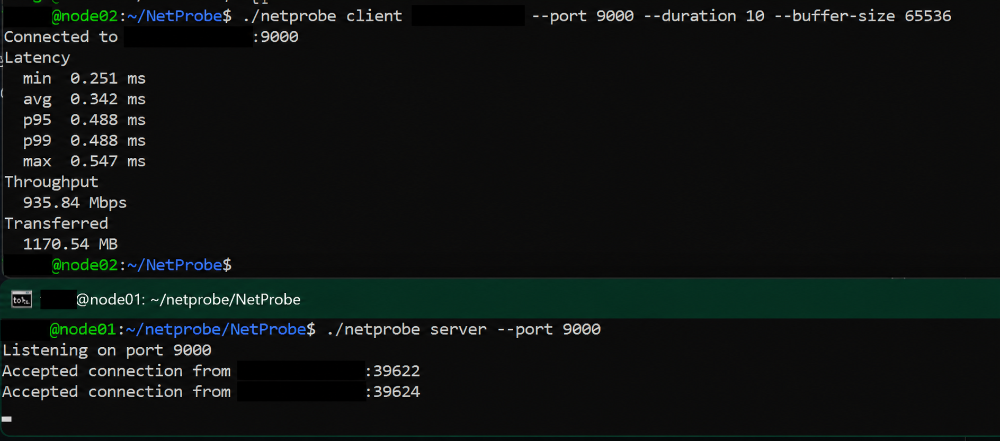

# NetProbe

NetProbe is a lightweight Linux TCP benchmarking tool written in C. It is a small systems-programming project built around POSIX sockets, `clock_gettime()`, pthreads, and standard Linux APIs.

A NetProbe server accepts benchmark connections and a client runs latency and throughput measurements against it. The protocol is intentionally small: each connection begins with a command byte identifying the benchmark, followed by either echoed latency probes or a throughput byte stream.

## Features

- TCP server and client modes
- configurable host and port
- 20-sample round-trip latency measurement
- min, average, max, p95, and p99 latency statistics
- sustained TCP throughput measurement
- total bytes transferred
- configurable throughput duration and buffer size
- clear terminal output and connection error handling
- Linux CI with unit, CLI, and local client/server integration tests

## Build

Requirements are a C11 compiler, POSIX threads, and a Linux environment.

```sh
make
```

The build enables `-Wall`, `-Wextra`, and `-Wpedantic` and produces the `netprobe` executable.

## Usage

Start a server:

```sh
./netprobe server --port 9000
```

Run a client against it:

```sh
./netprobe client 127.0.0.1 --port 9000 --duration 10 --buffer-size 65536
```

Client options:

| Option | Default | Description |
| --- | ---: | --- |
| `--port` | `9000` | TCP server port |
| `--duration` | `10` | Throughput test duration in seconds |
| `--buffer-size` | `65536` | Throughput send buffer size in bytes |

The client first opens a connection for the latency test, closes it, then opens a fresh connection for the throughput test. Throughput is reported in Mbps and transferred data in MB.

## Two-node homelab test

I tested NetProbe on my homelab using two nodes on the same network. On `node01`, I started the server:

```sh
./netprobe server --port 9000
```

On `node02`, I ran the client using `node01`'s reachable IPv4 address:

```sh
./netprobe client NODE01_IPV4 --port 9000 --duration 10 --buffer-size 65536
```

Replace `NODE01_IPV4` with the server node's address. This measures round-trip latency between the nodes and client-observed TCP throughput from `node02` to `node01`. To test the reverse direction, run the server on `node02` and the client on `node01`. The screenshot shows my homelab run with IP addresses hidden; results vary by network and host.



## Tests

Run the complete test suite with:

```sh
make test
```

The test target covers latency statistics, command-line validation, and a local end-to-end client/server benchmark. The same target runs in GitHub Actions for pushes and pull requests.

## Project layout

```text
include/        public headers
src/            implementation
tests/          unit, CLI, and integration tests
.github/        GitHub Actions workflow
Makefile        build and test targets
```

## Current limitation

The current throughput path is single-stream. Parallel client streams are not yet exposed as a command-line option.
